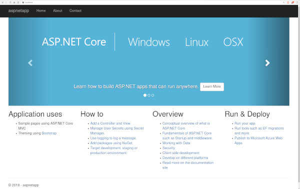

## Compose sample application: ASP.NET with MS SQL server database

**This repo is used for testing `kompose convert`**

The full command is `kompose convert --provider=openshift -f docker-compose.yaml --build build-config`

_Make sure to have an origin repo on GitHub, etc. in order to capture the buildconfig_

Then run oc apply -f .

---

Project structure:
```
.
├── app
│   ├── aspnetapp
│   │   ├── appsettings.Development.json
|   |   └── ...
│   ├── ...
│   └── Dockerfile
└── compose.yaml
```

[_compose.yaml_](compose.yaml)
```
services:
  web:
    build: app
    ports:
    - 8080:8080
  db:
    # mssql server image isn't available for arm64 architecture, so we use azure-sql instead
    image: mcr.microsoft.com/azure-sql-edge:1.0.4
    # If you really want to use MS SQL Server, uncomment the following line
    #image: mcr.microsoft.com/mssql/server
    ...
```
The compose file defines an application with two services `web` and `db`. The image for the web service is built with the Dockerfile inside the `app` directory (build parameter).

When deploying the application, docker compose maps the container port 8080 to port 8080 of the host as specified in the file.
Make sure port 8080 on the host is not being used by another container, otherwise the port should be changed.

> ℹ️ **_INFO_**  
> For compatibility purpose between `AMD64` and `ARM64` architecture, we use Azure SQL Edge as database instead of MS SQL Server.  
> You still can use the MS SQL Server image by uncommenting the following line in the Compose file   
> `#image: mcr.microsoft.com/mssql/server`

## Deploy with docker compose

```
$ docker compose up -d
Creating network "aspnet-mssql_default" with the default driver
Building web
Step 1/13 : FROM mcr.microsoft.com/dotnet/sdk:5.0 AS build
2.1: Pulling from dotnet/core/sdk
....
....
a9dca2f6722a: Pull complete
Digest: sha256:9b700672670bb3db4b212e8aef841ca79eb2fce7d5975a5ce35b7129a9b90ec0
Status: Downloaded newer image for microsoft/mssql-server-linux:latest
Creating aspnet-mssql_web_1 ... done
Creating aspnet-mssql_db_1  ... done
```


## Expected result

Listing containers must show two containers running and the port mapping as below:
```
$ docker ps
CONTAINER ID        IMAGE               COMMAND                  CREATED             STATUS              PORTS                  NAMES
7f3a2a7ea5c0        microsoft/mssql-server-linux   "/opt/mssql/bin/sqls…"   4 minutes ago       Up 4 minutes        1433/tcp             aspnet-mssql_db_1
27342dde8b64        aspnet-mssql_web               "dotnet aspnetapp.dll"   4 minutes ago       Up 4 minutes        0.0.0.0:8080->8080/tcp   aspnet-mssql_web_1
```

After the application starts, navigate to `http://localhost:8080` in your web browser.



Stop and remove the containers

```
$ docker compose down
```
